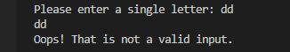

# Hangman
Hangman is a classic game in which a player thinks of a word and the other player tries to guess that word within a certain amount of attempts.

This is an implementation of the Hangman game, where the computer thinks of a word and the user tries to guess it. 

## Objective

The main aim of this project was to go over and practice basic Python syntax. It utilises OOP principles and is therefore built around one class,Hangman, which includes three methods:

__init__(self, word_list, num_lives=5), that initialises the attributes as indicated in the docstring;
check_letter(self, letter) -> None, that checks if the input letter provided by the user is in the random word;
ask_letter(self), that asks the user for a letter and checks if this letter has already been tried, and if the input is correct.
Being a command line application, the program can be executed using the Python3 hangman_solution.py command.

Upon initialisation, the user is informed of the length of the randomly selected word to be guessed, which is presented to them as an empty list along the lines of that in the following image.

 

 The user is then asked to guess a single letter and input it in the programme repeatedly, until they either win or lose the game. Messages are displayed throughout, as I discuss in what follows.

## Milestone 1

The basic logic of the Hangman game was provided in a publicly accessible template by AiCore. Milestone 1 (M1) was straightforward, and is marked in the hangman.solution.py file as # TODO 1. M1 basically only required to modify the ask_letter() method to ask the user to input a letter, store it in a variable called letter, and check whether letter was just one character, or more.

letter = input("Please enter a letter: ")
if len(letter) != 1:
    print("Please, enter just one character")
To test the code, the ask_letter() method can be called within the play_game() function. In case of a wrong input of more than one character, the programme is instructed to print the following message:

    letter = input("Please enter a letter: ")

    if len(letter) != 1:

    print("Please, enter just one character")

To test the code, the ask_letter() method can be called within the play_game() function. In case of a wrong input of more than one character, the programme is instructed to print the following message:

To test the code, the ask_letter() method can be called within the play_game() function. In case a user inputs one character, the programme is instructed to print the following message:

## Milestone 2

All required functionalities implemented in M2 are marked in hangman_solution.py as # TODO 2. M2 required the initialisation of the program's attributes as required in the docstring. These were as below:

     def __init__(self, word_list, num_lives=5):
        self.word = random.choice(word_list)
        self.word_guessed = list('_' * len(self.word))
        self.num_letters = len(set(list(self.word)))
        self.num_lives = num_lives
        self.list_letters = []
        print(f"The mistery word has {self.num_letters} characters")
        print(f"{self.word_guessed}")

word is an attribute of the string type assigned to a word chosen randomly by the machine from word_list, a list that contains the following 6 elements: ['apple', 'banana', 'orange', 'pear', 'strawberry', 'watermelon']. For this random selection to be possible, I imported the random package. word_guessed is a list attribute that contains as many '_' strings as there are characters in the randomly picked word; for this, I decided to use the len() string method. num_letters stores the number of unique letters in the word that have not been guessed yet as an integer. To do so, I first converted word into a list type using the list() method, and then used len() on the unique unique letters within it, which I singled out using the set() method. Finally, I initialised num_lives, the number of lives left, as an integer set later in the program as 5, and list_letters as a list to which all letters tried by the user are appended during the game. As required in the template, the programme runs print(f"{letter} was already tried") if the letter tried by the user is already in list_letters.

To check whether the __init__ method worked, __init__(word_list) can be called within the play_game() function, thus initialising the messages seen in the introduction, which I repeat below.
